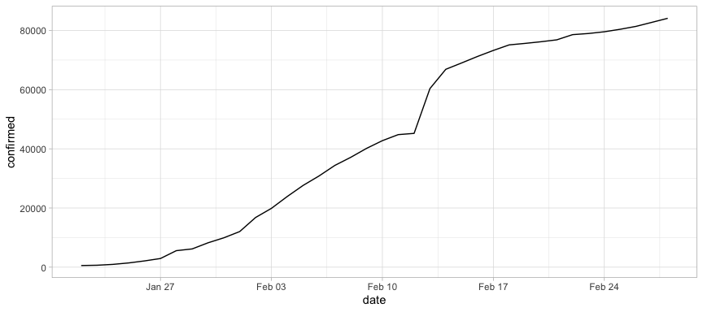

COVID Updates
================

This repo provides hourly updates from the [World Helath
Organization](https://www.who.int/) [Coronavirus disease (COVID-2019)
situation
reports](https://www.who.int/emergencies/diseases/novel-coronavirus-2019/situation-reports/)
in [CSV](https://github.com/javierluraschi/covid/tree/datasets) and
[pins](https://pins.rstudio.com) format.

From R, you can query the list of available datasets as follows:

``` r
library(pins)

board_register_datatxt("https://raw.githubusercontent.com/javierluraschi/covid/datasets/data.txt", "covid")

pin_find(board = "covid")
```

    ## # A tibble: 94 x 4
    ##    name             description type  board
    ##    <chr>            <chr>       <chr> <chr>
    ##  1 covid-20200228-1 ""          table covid
    ##  2 covid-20200228-2 ""          table covid
    ##  3 covid-20200228-3 ""          table covid
    ##  4 covid-20200228-4 ""          table covid
    ##  5 covid-20200227-1 ""          table covid
    ##  6 covid-20200227-2 ""          table covid
    ##  7 covid-20200227-3 ""          table covid
    ##  8 covid-20200226-1 ""          table covid
    ##  9 covid-20200226-2 ""          table covid
    ## 10 covid-20200225-1 ""          table covid
    ## # … with 84 more rows

You can then retrieve specific tables from the daily reports as follows:

``` r
pin_get("covid-20200227-1", board = "covid")
```

    ## # A tibble: 41 x 6
    ##    V1        V2         V3        V4        V5     V6        
    ##    <chr>     <chr>      <chr>     <chr>     <chr>  <chr>     
    ##  1 Province/ ""         ""        Daily     ""     Cumulative
    ##  2 ""        Population ""        ""        ""     ""        
    ##  3 Region/   ""         ""        ""        ""     ""        
    ##  4 ""        (10,000s)  Confirmed Suspected ""     Confirmed 
    ##  5 City      ""         ""        ""        Deaths Deaths    
    ##  6 ""        ""         cas es    cas es    ""     cases     
    ##  7 Hubei     5917       409       403       26     65596 2641
    ##  8 Guangdong 11346      0         0         0      1347 7    
    ##  9 Henan     9605       1         2         1      1272 20   
    ## 10 Zhejiang  5737       0         0         0      1205 1    
    ## # … with 31 more rows

Do notice that this dataset come straight from the PDF files, while the
data is kept up-to-date by parsing it as soon as it’s released, the
headers still need to be cleaned up and some tables joined together.

The CSV files can be found under
[covid/tree/datasets](https://github.com/javierluraschi/covid/tree/datasets),
a cleaned up dataset can be found in other repos like
[ramikrispin/coronavirus-csv](https://github.com/RamiKrispin/coronavirus-csv)
and downloaded with pins as
follows:

``` r
covid <- pin("https://raw.githubusercontent.com/RamiKrispin/coronavirus-csv/master/coronavirus_dataset.csv") %>%
  read.csv() %>% tibble::as_tibble() %>% print()
```

    ## # A tibble: 2,309 x 7
    ##    Province.State Country.Region   Lat  Long date       cases type     
    ##    <fct>          <fct>          <dbl> <dbl> <fct>      <int> <fct>    
    ##  1 ""             Japan           36    138  2020-01-22     2 confirmed
    ##  2 ""             South Korea     36    128  2020-01-22     1 confirmed
    ##  3 ""             Thailand        15    101  2020-01-22     2 confirmed
    ##  4 Anhui          Mainland China  31.8  117. 2020-01-22     1 confirmed
    ##  5 Beijing        Mainland China  40.2  116. 2020-01-22    14 confirmed
    ##  6 Chongqing      Mainland China  30.1  108. 2020-01-22     6 confirmed
    ##  7 Fujian         Mainland China  26.1  118. 2020-01-22     1 confirmed
    ##  8 Guangdong      Mainland China  23.3  113. 2020-01-22    26 confirmed
    ##  9 Guangxi        Mainland China  23.8  109. 2020-01-22     2 confirmed
    ## 10 Guizhou        Mainland China  26.8  107. 2020-01-22     1 confirmed
    ## # … with 2,299 more rows

``` r
library(dplyr, warn.conflicts = FALSE)
library(ggplot2)

filter(covid, type == "confirmed") %>%
  group_by(date) %>%
  summarise(confirmed = sum(cases)) %>%
  arrange(date) %>%
  mutate(date = as.Date(date), confirmed = cumsum(confirmed)) %>%
  ggplot(aes(x=date, y=confirmed)) + geom_line() + theme_light()
```

<!-- -->
